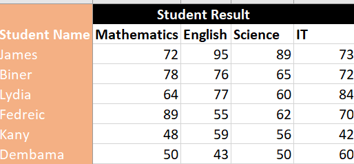
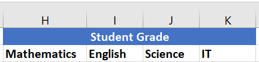
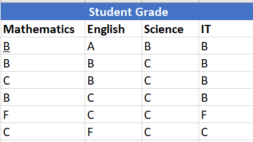
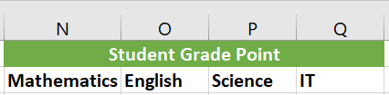
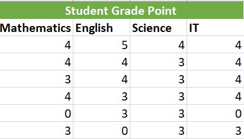
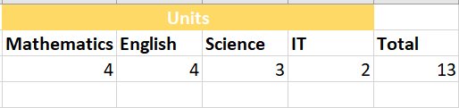
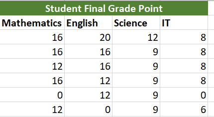
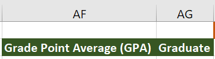
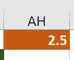
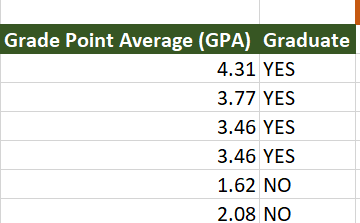

# Basic Excel Functions  

## Introduction
In this project, I use Excel to demonstrate my comprehension of some fundamental functions of Excel for data analysis.

## Skill/ Concepts Demonstrated
1. SUM
2. MULTIPLY
3. DIVISION
4. REFRENCING
5. FORMATING
6. IF/S

## Project
1. I create a table of six students with their scores in subjects like Mathematics, English, Science and IT

    

2. I create another table called student grade by merging cells H1 upto K1 and called it student grade and i input the subject name in H2, I2, J2, and K2

     
   
3. I wrote an IF statement that checked the scores of the students per subject and returned grades as 
follows:

    
     
  - A if score is greater than or equal to 90
  - B if score is greater than or equal to 70 but less than 90
  - C if score is greater than or equal to 50 but less than 70
  - If the score is less than 50

  
  
4. I Create another table title by merging cells N1:Q1, name it “Student Grade Point,” and format the background to be blue with a bold white font.
   
5. I input the subject's name again at N2:Q2 and bold

   
  
6. I Write another IF statement for one of the cells that checks the scores of the students per subject and returns the grade 
points, then use **FLASH FILL** to complete the rest as follows:
  - 5 if grade is “A”
  - 4 if grade is “B”
  - 3 if grade is “C”
  - 0 if grade is “F”

   
   
7. I Create a table title by merging cells T1:W1 and naming it **Units**. Format background to be 
yellow color and bold black font.
8. I input the subject's name again at T2:W2 and bold   
9. I Assign the following units to the subjects (T3:W3):
-  Mathematics – 4
-  nglish – 4
-  cience – 3
- Information Technology – 2

  
10. I Create a table title by merging cells Z1:AC1 and name it **Student Final Grade Point**. Format 
background to be dark green and bold white font. then i input the subjects name again at Z2:AC2

 

 
11. I Wrote a formula to multiply the grade point of each student by the corresponding course unit 
in the “Units” table with the help of **Excel Refrencing and Flash Fill**

        

   
12. In cell AF2, I input **Grade Point Average (GPA)**, and format the background to be dark green.
and bold white font. Ensure all characters are seen and Format the GPA to 2 decimal places

13. In cell AG2, I input **Graduate**. Format background to be dark green and bold white
font

 
  
14. In cell AH1, I input 2.5. Format background to be red and bold white font

     
15. For each student, I add all the final grade points from the courses and divide by the summation 
of all course units (T3:W3)
16. I Write a formula to determine if the student will graduate or not using:
-  **YES** if GPA is greater than or equal to 2.5 (cell AH1)
-  **NO** if GPA is less than 2.5 (cell AH1)

   

  

